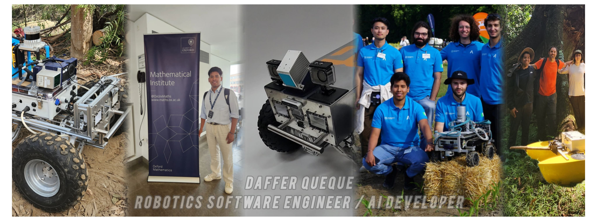
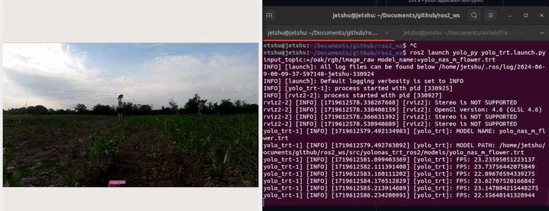
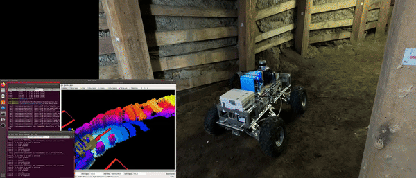

# 

## 👋 About Me
Hello! I'm Daffer Queque, an experienced (3+ years) Robotics Software Engineer and AI developer specializing in autonomous vehicles, computer vision, ROS, machine learning, sensor integration, and navigation systems.

## 🚀 Selected Projects

### Project 1: Grasslammer Autonomous Robot for Agriculture 4.0

**Description:** Deployed YOLO NAS on Jetson Orin AGX with TensorRT FP16 in ROS2, achieving 24 FPS, 0.97 mAP, 0.89 Precision, 0.93 Recall. Enhanced with C++ for 2D to 3D conversion and EKF SLAM. Represented Politecnico di Milano at the 2024 Field Robotic Event in Germany. [Github](https://github.com/djetshu/yolonas_trt_ros2)

### Project 2: Wireless All-Terrain Robot for Autonomous Tunnel Inspection and Digitization

**Description:** Led Level 3 autonomous navigation in GPS-denied underground galleries using RGB, thermal cameras, and 3D LIDAR with ROS and C++. Implemented YOLO V8 and YOLO NAS on Jetson Orin AGX, achieving 0.91 mAP and 30 FPS. Showcased the system at PERUMIN 2023, an international mining fair. [Videos](https://youtube.com/playlist?list=PLSkv-kp1fWR9WA9yLv0nKHr0DcV82yVEo&si=Jv890t6X3l6c3mMi)

## 🛠️ Skills
- **Programming Languages:** Python, C++, Java.
- **Robotics Frameworks:** ROS 1/2 (Robot Operating System), Gazebo, NAV1/2, Isaac Sim Nvidia.
- **AI Frameworks:** Pytorch, Tensorflow.
- **Tools and Technologies:** Git, Docker, Jupyter.
- **Operating Systems:** Ubuntu, Windows.

## 📫 Contact Me
- **Email:** daffer.queque@outlook.com
- **LinkedIn:** [linkedin/daffer-queque](https://www.linkedin.com/in/daffer-queque/)
